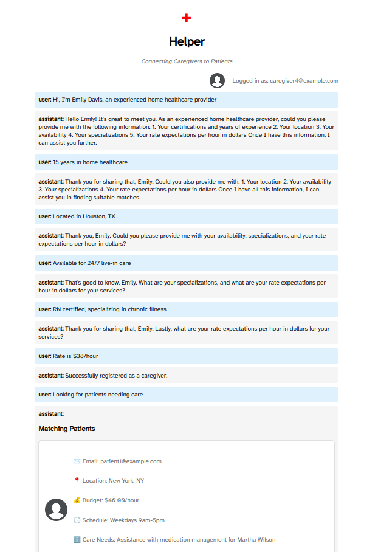
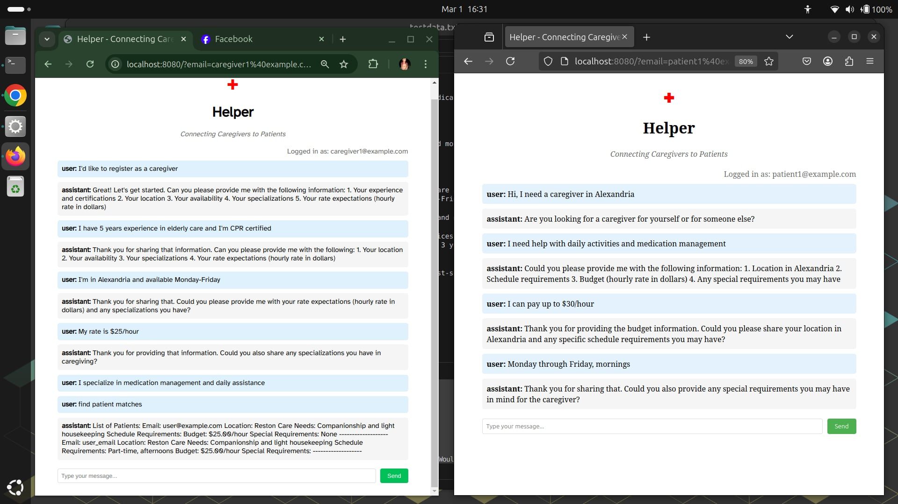

helper2
===========

This is a cursor-built application that uses a chat interface, and embedded SQL storage to run a gig app for caregivers and their patients.  As an exercise, it started off as Prolog.  But LLMs are way more familiar with SQL, and I may come back to Prolog on a different kind of app that makes more sense.

The main thing is to use OpenAI tool use, function calling, to accomplish this. Instead of painstakingly describing the output format in a system prompt, it uses function calling to invoke methods to save data into the database or run queries.

Caregivers and patients have the same chat interface. If verbosity can be lower, a voice interface might be a possibility.

The main point of it is that ever chat message is inspected by OpenAI for facts to write into the relational database. So, profiles of caregivers and patients are built up through chat, and the admin interrogating them.

Once patients and caregivers have profiles, match requests will work.

todo:
- city matching is not good, because it is by string. i may have to just assume that a running Go server is for a shard, where all the cities are within driving distance. otherwise, i need a way to calculate distances from city names; but in any case, you want the data sharded by driving distance.

Testing
=========

In order to test it, there is a file that annotates a bunch of messages with the email address for the user, to represent sessions. The messages are ignoring responses from admin, and just sending chatter; but this works well in any case. The sessions look realistic when you login to read them. The matches make sense. A change I may make is to not filter on city, and assume that everything in the database is within driving distance; because a shard (ie: Northern Virginia) is selected by people in that area.

